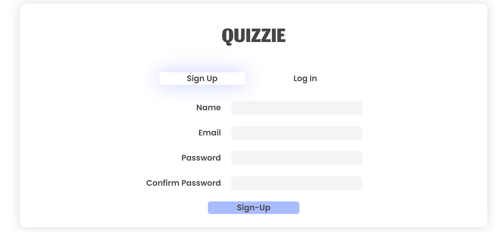
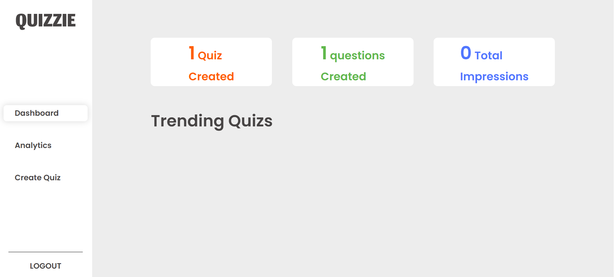
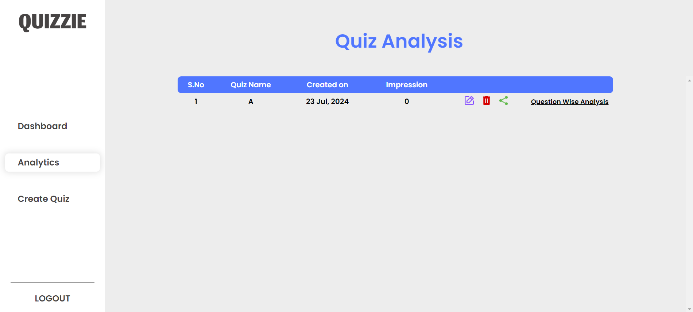
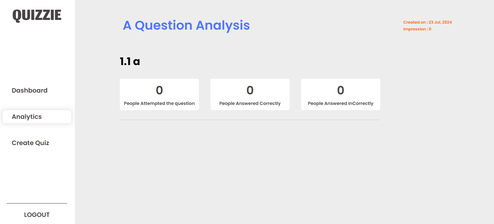
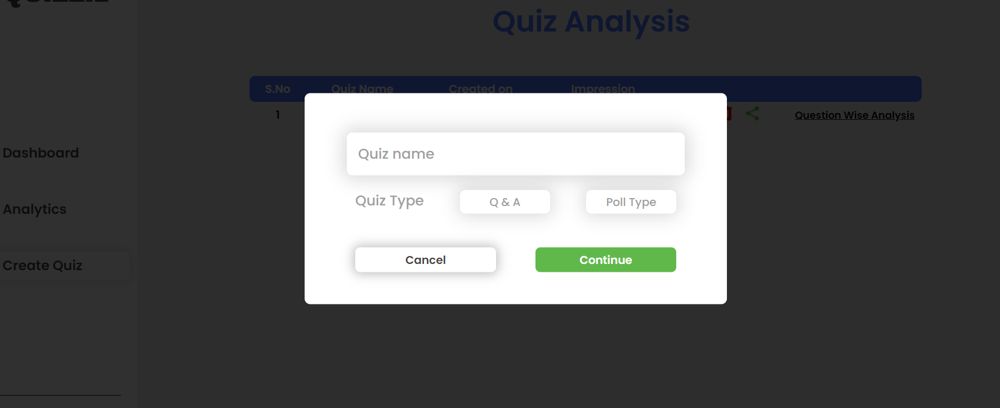
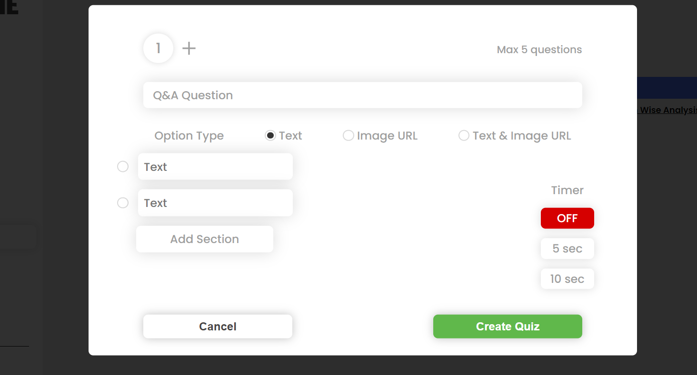
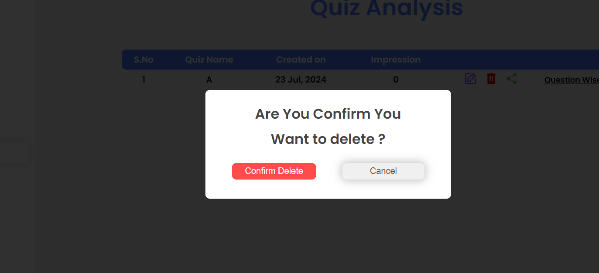
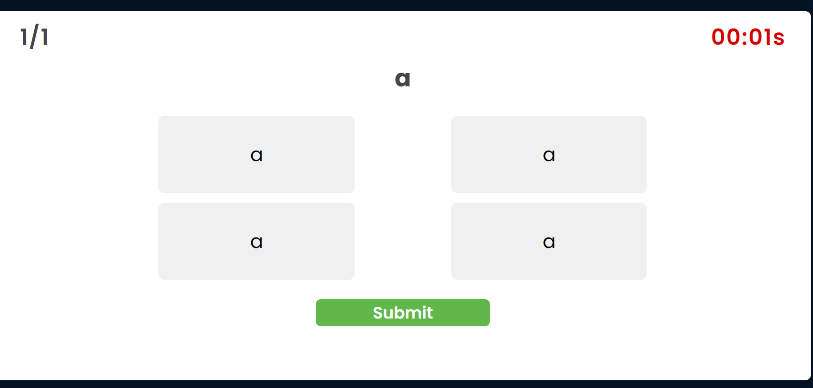
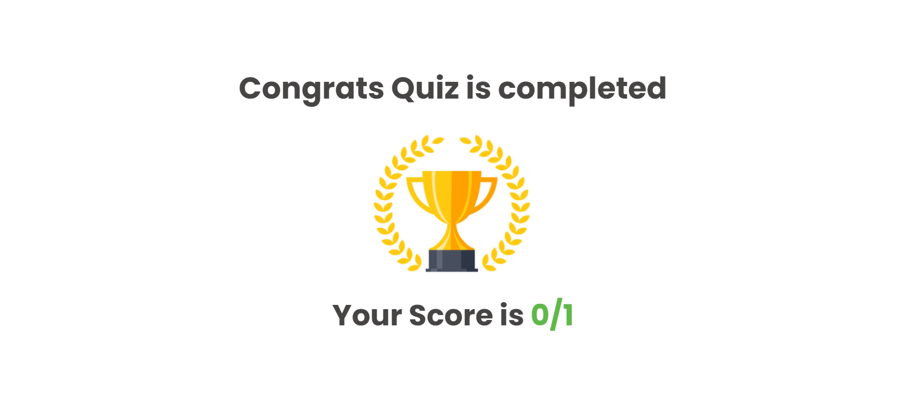

# 🚀 Quiziee

Quiziee is a web application built with the **MERN** (MongoDB, Express.js, React.js, Node.js) stack, featuring a dynamic quiz platform with state management handled by **Redux**. This repository contains both the frontend and backend code for Quiziee.

## ✨ Features

- 📝 **Create and Manage Quizzes**: Easily create quizzes with multiple questions and manage them through an intuitive interface.
- 🎯 **Take Quizzes and Receive Instant Feedback**: Users can take quizzes and get real-time feedback on their performance.
- 🔐 **User Authentication and Authorization**: Secure user authentication using **JWT** (JSON Web Token).
- 📊 **Dashboard for Quiz Statistics and User Management**: View quiz statistics and manage users through a comprehensive dashboard.
- 📱 **Responsive Design**: Optimized for both mobile and desktop devices.

## 🛠️ Technologies Used

### Frontend

- **React.js**: JavaScript library for building user interfaces.
- **Redux**: State management library for JavaScript apps.
- **Axios**: Promise-based HTTP client for making API requests.
- **Tailwind CSS**: Utility-first CSS framework for rapid UI development.
- **Netlify**: Hosting service for web applications.

### Backend

- **Node.js**: JavaScript runtime built on Chrome's V8 engine.
- **Express.js**: Web application framework for Node.js.
- **MongoDB Atlas**: Cloud-hosted MongoDB service.
- **JWT**: Standard for creating access tokens for authentication.
- **Render**: Cloud platform for hosting web applications.

## ⚙️ Getting Started

### Prerequisites

Ensure you have the following installed on your local environment:

- **Node.js**
- **npm** (Node Package Manager)
- **MongoDB Atlas** account

### Installation

1. **Clone the repository**:

    ```bash
    git clone https://github.com/yourusername/quiziee.git
    cd quiziee
    ```

2. **Install dependencies**:

    - For the **backend**:

      ```bash
      cd backend 
      npm install
      ```

    - For the **frontend**:

      ```bash
      cd ../frontend
      npm install
      ```

### 🔧 Configuration

#### Backend:

1. Create a `.env` file in the `backend` directory and add the following environment variables:

    ```bash
    PORT=5000
    MONGO_URI=your_mongodb_atlas_uri
    JWT_SECRET=your_jwt_secret
    ```

#### Frontend:

1. Create a `.env` file in the `frontend` directory and add the following environment variable:

    ```bash
    REACT_APP_API_URL=http://localhost:5000
    ```

### 🚀 Running the Application

1. **Start the backend server**:

    ```bash
    cd backend
    npm start
    ```

2. **Start the frontend server**:

    ```bash
    cd ../frontend
    npm start
    ```

3. Open your browser and navigate to [http://localhost:3000](http://localhost:3000) to view the application.

## 🚢 Deployment

### Frontend

The frontend is hosted on **Netlify**. Follow the steps below to deploy:

1. Push your code to a GitHub repository.
2. Link your repository to **Netlify**.
3. **Netlify** will automatically build and deploy your frontend.

### Backend

The backend is hosted on **Render**. Follow the steps below to deploy:

1. Push your code to a GitHub repository.
2. Link your repository to **Render**.
3. **Render** will automatically build and deploy your backend.

## 📂 Project Structure

quiziee/ ├── backend/ │ ├── controllers/ │ ├── models/ │ ├── routes/ │ ├── server.js │ └── .env └── frontend/ ├── src/ ├── components/ ├── redux/ ├── App.js └── .env

## Screenshot Section











